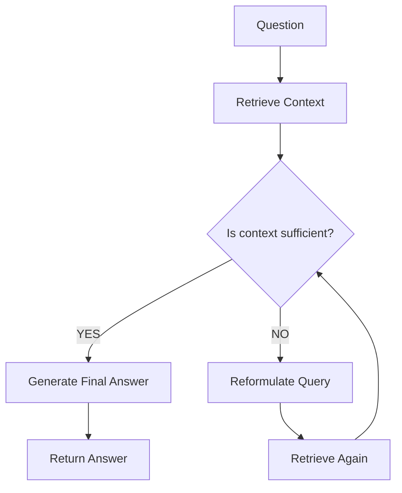

# Agentic RAG: HR Policy Assistant Demo

Comparison of Traditional RAG vs Agentic RAG using an HR Policy document.
Day 33 adds migration from ChromaDB to Pinecone with performance comparison.

## Run

```bash
uv sync

# Day 32 — Traditional vs Agentic RAG (ChromaDB)
python traditional_rag.py
python agentic_rag.py

# Day 33 — ChromaDB vs Pinecone Migration
python setup_pinecone.py   # run once
python compare.py
```

## Workflow

### Traditional RAG
Question → Retrieve (once) → Generate Answer

### Agentic RAG


## Day 32 — Traditional RAG vs Agentic RAG (ChromaDB)

| Question | Traditional RAG | Agentic RAG |
|---|---|---|
| How many days of annual leave? | 1 retrieval, 0.59s | 1 retrieval, 0.47s |
| What is the remote work policy? | 1 retrieval, 0.41s | 1 retrieval, 0.52s |
| What if employee breaches confidentiality? | 1 retrieval, 0.52s | 1 retrieval, 0.42s |
| How is performance bonus calculated? | 1 retrieval, 0.39s | 1 retrieval, 0.62s |
| Can a new joiner work from home? | 1 retrieval, ~0.5s | 1 retrieval, 0.48s |
| Financial penalties for gift violations? | 1 retrieval, gave wrong/partial answer | 3 retrievals, 2.0s → "I don't have enough information" |

### Key Observations
- Traditional RAG always does 1 retrieval — fast but no self-evaluation
- Agentic RAG evaluates if context is sufficient before answering
- For unanswerable questions, Agentic RAG reformulated the query 2 times, then correctly admitted it couldn't find the answer
- Trade-off: Agentic RAG is slower on hard questions but more reliable and honest

## Day 33 — ChromaDB vs Pinecone Migration (Agentic RAG)

| Question | ChromaDB | Pinecone |
|---|---|---|
| How many days of annual leave? | 1 retrieval, 0.46s | 1 retrieval, 0.71s |
| What is the remote work policy? | 1 retrieval, 0.38s | 1 retrieval, 0.65s |
| What if employee breaches confidentiality? | 1 retrieval, 0.27s | 1 retrieval, 0.56s |
| How is performance bonus calculated? | 1 retrieval, 0.39s | 1 retrieval, 0.63s |
| Can a new joiner work from home? | 1 retrieval, 0.33s | 2 retrievals, 1.30s |
| Financial penalties for gift violations? | 3 retrievals, 1.25s → no info | 3 retrievals, 11.47s → no info |

### Latency Report

| | ChromaDB | Pinecone |
|---|---|---|
| Average response time | 0.51s | 2.55s |
| Answer quality |  Same | Same |
| Retrieval accuracy |  Same |  Same |
| Faster overall |  Yes | — |

### Key Observations
- Answer quality is identical — migration did not affect retrieval accuracy
- ChromaDB is faster for small datasets because it runs locally (no network hop)
- Pinecone adds ~0.2–0.5s latency per query due to cloud API calls
- On hard questions (3 retrieval attempts), Pinecone latency spikes to 11s vs 1.25s for ChromaDB
- At production scale (millions of vectors), Pinecone wins on scalability, filtering, and zero maintenance